# Tosca Architecture Diagrams

> Visual reference for interviews, design reviews, and onboarding. Pair with [Part 1]() and [Hands-on Exercises]().

---

## 1. Tosca Platform Overview

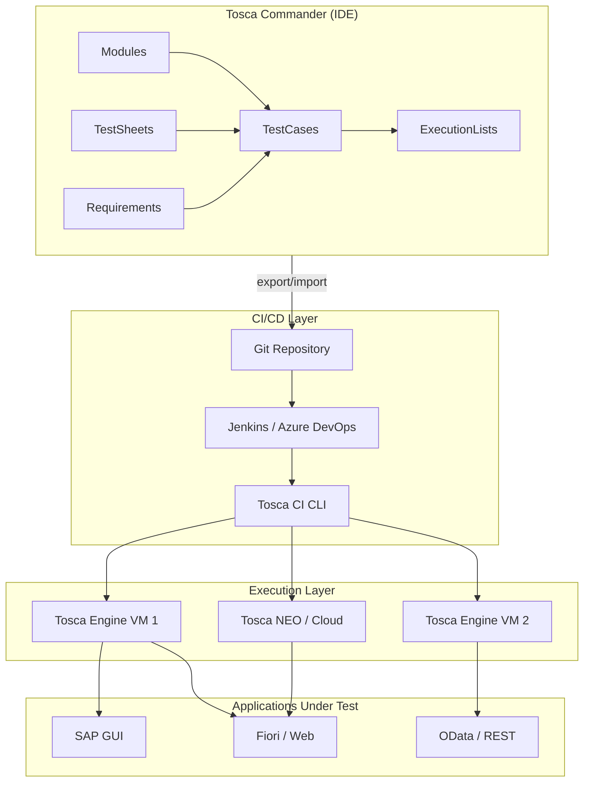

---

## 2. Model-Based Testing vs Record-and-Playback

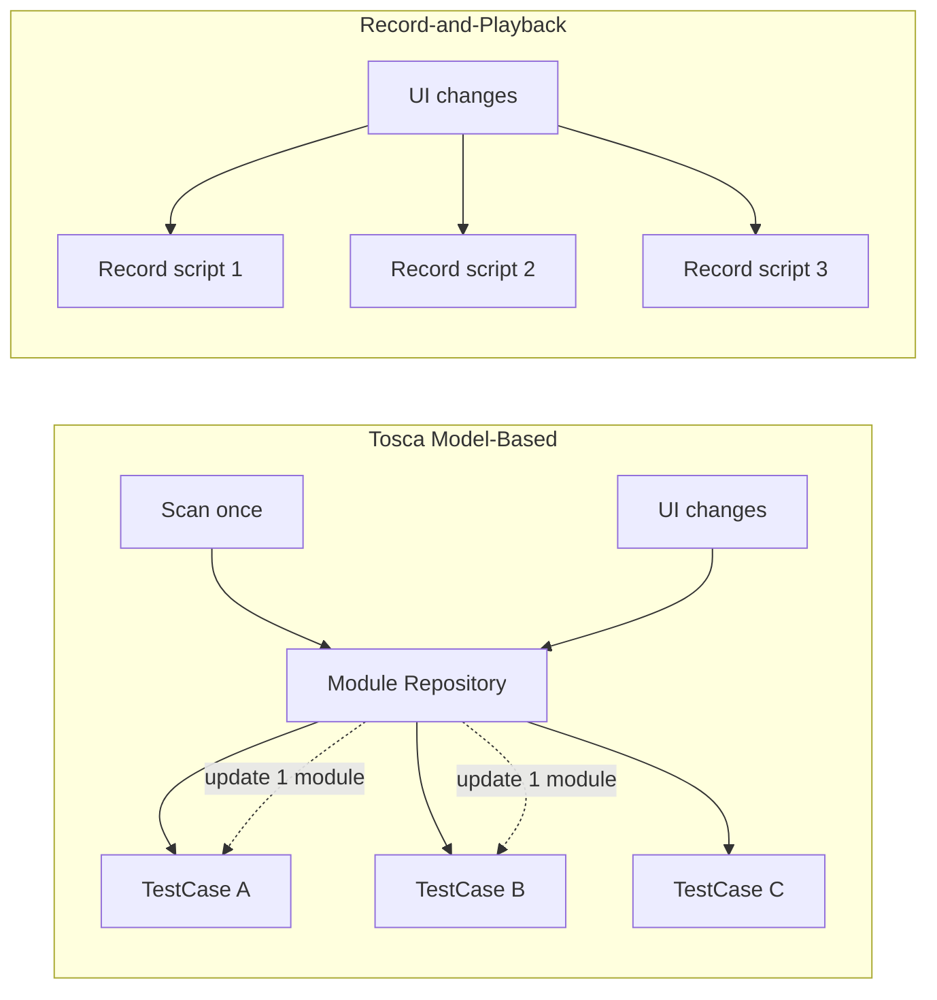

**Interview line:** One Module update propagates to all TestCases — that's the reuse advantage.

---

## 3. Framework Layer Architecture

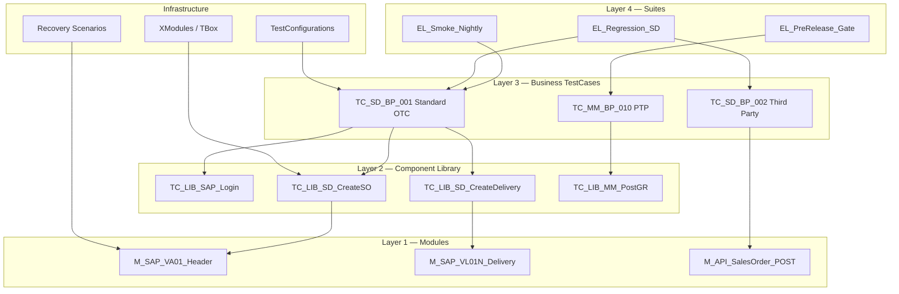

---

## 4. Standard OTC Automation Flow (SAP SD)

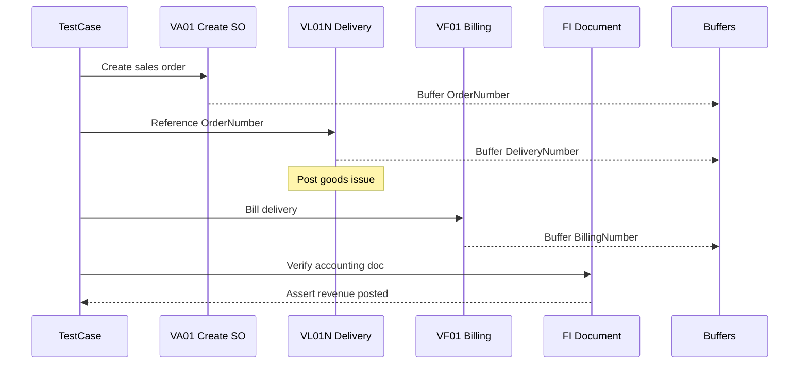

---

## 5. Hybrid API + GUI TestCase

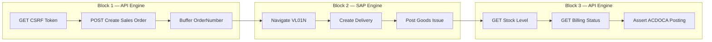

**Staff insight:** API blocks run in seconds; GUI only where popups and complex screens matter.

---

## 6. Buffer Lifecycle Across ExecutionList

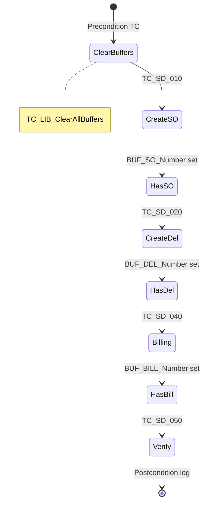

---

## 7. Recovery Scenario Decision Flow

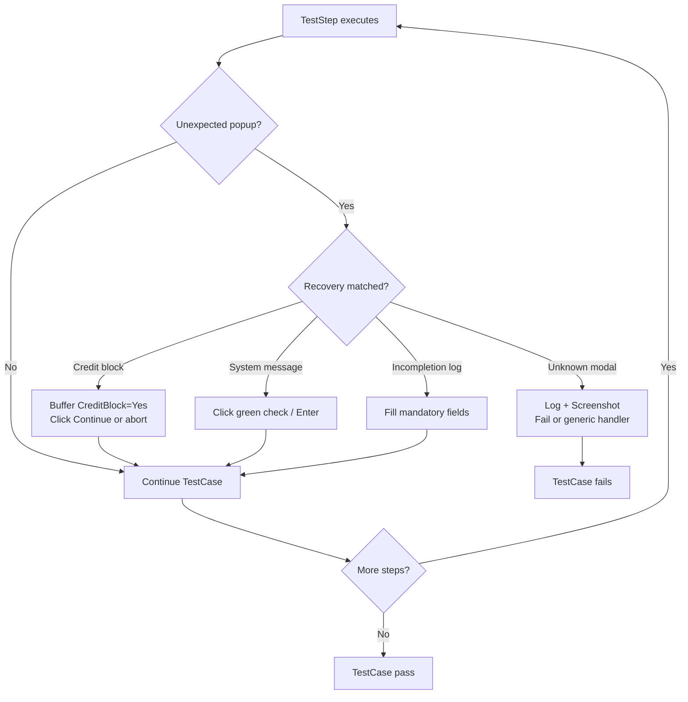

**Priority order:** Specific recoveries first → generic system message last.

---

## 8. CI/CD Pipeline

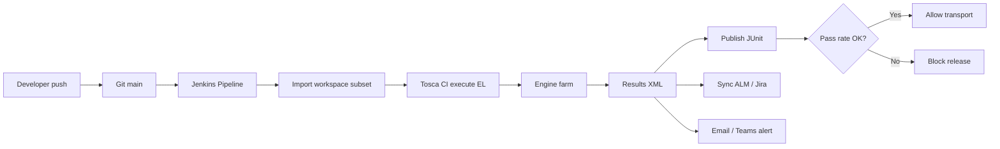

---

## 9. Distributed Execution

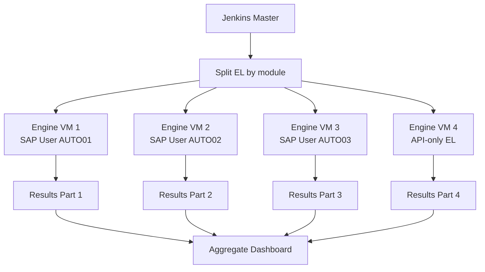

---

## 10. Test Pyramid for SAP Landscapes

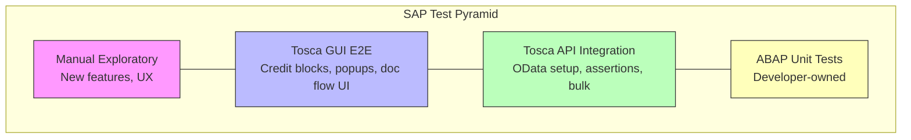

---

## 11. S/4 Migration Automation Phases

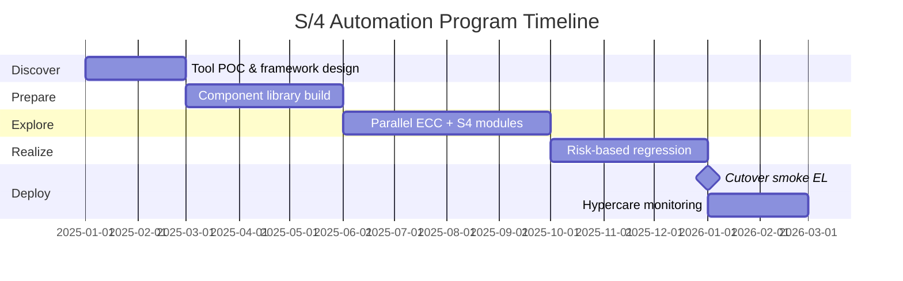

---

## 12. Self-Healing Identification Layers

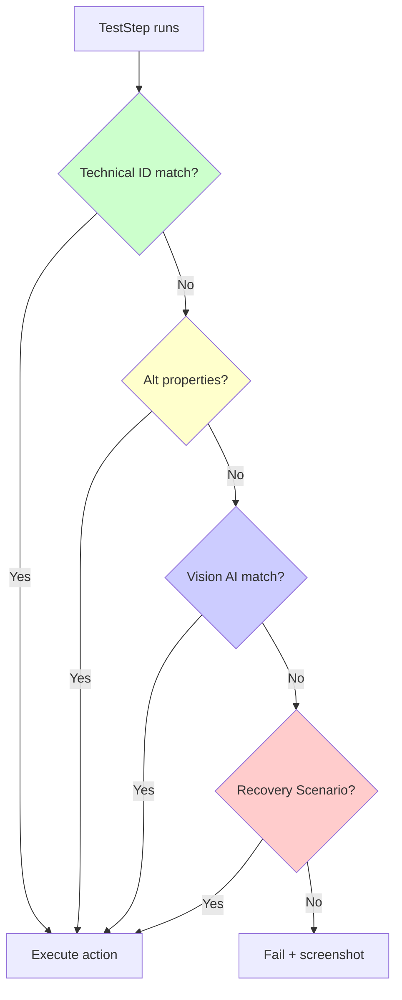

---

## 13. Procure-to-Pay (MM) Automation Flow

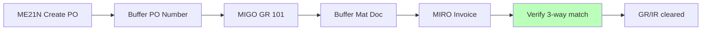

Cross-reference: [SAP MM guide](#sap-mm-materials-management).

---

## 14. Data-Driven Test Execution

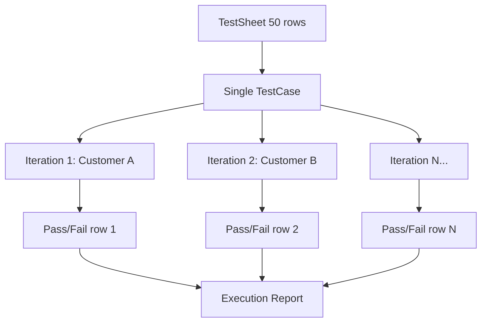

---

## Quick Reference — ASCII (Print-Friendly)

### Tosca Object Hierarchy

```
ExecutionList
└── TestCase (business scenario)
    ├── TestStep → Module Attribute → Action
    ├── TestSheet (data rows)
    ├── Recovery Scenario (attached)
    └── TBox Script (logic)
Module
└── Attribute (button, field, table cell, API field)
```

### SAP Scripting Enablement

```
Server (RZ11):  rdisp/gui_auto_accept_server = 1
Client (Logon): Scripting → Enable
Engine VM:      SAP GUI installed + scripting on
Verify:         Scripting console can drive wnd[0]
```

---

> **Practice:** Turn each diagram into a 2-minute whiteboard explanation.  
> **Next:** [Hands-on Exercises]() · [Printable Checklist]()
